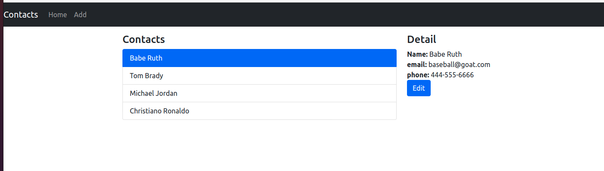
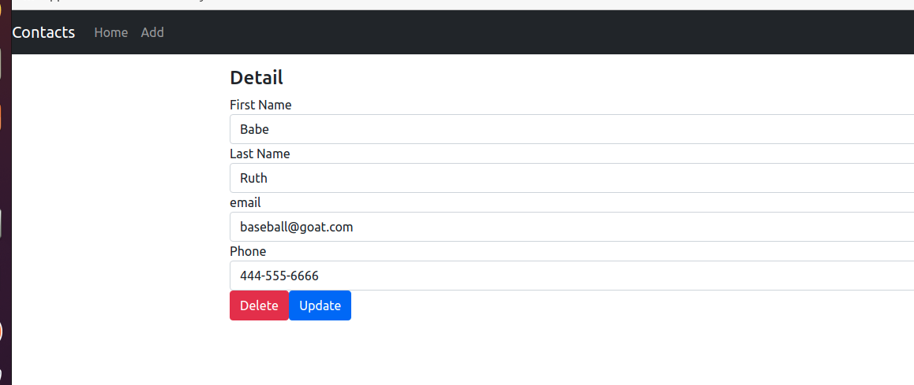

# Simple Contact Manager webapp using docker
## Using nodejs (express) / reactjs / posgresql (docker)

### Influenced by [bezkoder node express postgresql webapp](https://bezkoder.com/node-express-sequelize-postgresql/)


### Build api docker image and run

1. in api directory, I alredy created Dockerfile
2. docker build -t yunbo/contact-manager-api:1.0 .
3. docker run -p 8080:8080 --env-file ./.env --network contact-manager-network --name api yunbo/contact-manager-api:1.0
   1. If network not created yet,
   ```
   $ docker network create contact-manager-network


### Build frontend docker image and run

4. in frontend directory, I already created Dockerfile
5. docker build -t yunbo/contact-manager-frontend:1.0 .
6. docker run -p 8001:80 --network contact-manager-network --name frontend yunbo/contact-manager-frontend:1.0
   Unfortunately react app makes harder to use .env file separately. you have to include .env in docker image


### Run app

7. when all dockers are running, go to localhost:8001


### Screenshots







### TODO
1. in api, we will need to add login that returns jwt token
2. in frontend, api controller, instead of using simple http request style, it should be api manager that gets token and refresh if it expires